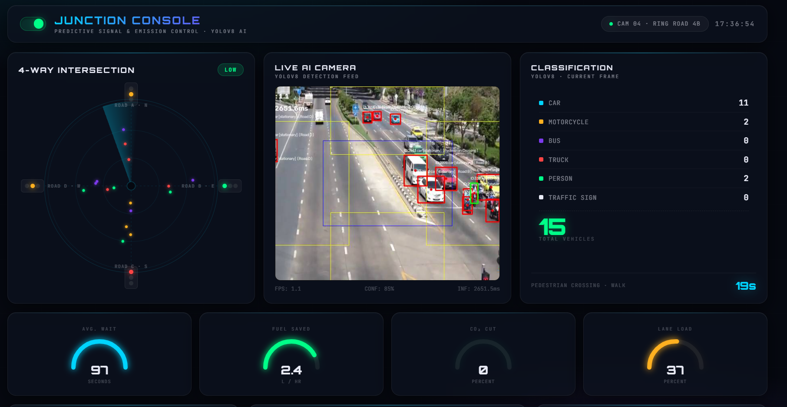

<div align="center">

# 🚦 Smart Traffic Management System

### AI-Powered Adaptive Traffic Control using Computer Vision

Monitor traffic in real time, detect and track vehicles, analyze congestion, and optimize traffic signals using **YOLOv8**, **FastAPI**, and **OpenCV**.

<p align="center">


</p>

**Real-Time Vehicle Detection • Intelligent Signal Optimization • Live Dashboard • Traffic Analytics**

</div>

---

# 📸 Project Preview

## 🖥️ Main Dashboard

<p align="center">

</p>

The dashboard provides a live AI camera feed, traffic signal visualization, congestion statistics, vehicle classification, signal timing, and manual control for the intersection.

---

## 📊 Analytics Dashboard

<p align="center">

</p>

Historical analytics including traffic trends, congestion probability, wait time estimation, and system event logging.


---

# 💡 Why This Project?

Conventional traffic lights rely on **fixed timing schedules**, regardless of the actual traffic volume. During low traffic periods, vehicles wait unnecessarily, while during heavy traffic, fixed cycles often cause severe congestion.

The **Smart Traffic Management System** addresses this problem by using **computer vision** to monitor intersections in real time, estimate traffic density, and recommend adaptive traffic signal timings.

The goal is to reduce:

- 🚗 Vehicle waiting time
- ⛽ Fuel consumption
- 🌍 Carbon emissions
- 🚦 Traffic congestion

---

# ✨ Features

## 🚗 Real-Time Vehicle Detection

- YOLOv8 object detection
- Bounding box visualization
- Confidence scores
- Multi-class detection

Supported classes:

- Car
- Bus
- Truck
- Motorcycle
- Person
- Traffic Sign

---

## 🎯 Multi-Object Tracking

- ByteTrack tracking
- Persistent vehicle IDs
- Queue detection
- Lane-wise counting
- Vehicle history

---

## 🚦 Intelligent Signal Optimization

- Adaptive green-light allocation
- Lane congestion analysis
- Dynamic signal cycles
- Queue-based timing recommendations
- Manual override mode

---

## 📊 Traffic Analytics

- Vehicle counts
- Lane occupancy
- Congestion prediction
- Wait time estimation
- Fuel savings estimation
- CO₂ reduction estimation

---

## 📹 Live Streaming

- MJPEG camera stream
- Browser-based viewing
- Low-latency updates
- WebSocket synchronization

---

## 📈 Interactive Dashboard

- Live AI camera feed
- Junction visualization
- Signal timer
- Vehicle classification
- Congestion gauge
- Event logs
- Ambient conditions
- Manual controls

---

# 🏗️ System Architecture

```text
                   Camera / CCTV
                         │
                         ▼
                 OpenCV Video Capture
                         │
                         ▼
               YOLOv8 Object Detection
                         │
                         ▼
              ByteTrack Object Tracking
                         │
                         ▼
            Shapely Lane Assignment (ROI)
                         │
              ┌──────────┴──────────┐
              ▼                     ▼
      Traffic Statistics      Signal Logic
              │                     │
              └──────────┬──────────┘
                         ▼
                  FastAPI Backend
                         │
          ┌──────────────┴──────────────┐
          ▼                             ▼
     SQLite / PostgreSQL          WebSocket API
                                        │
                                        ▼
                               Live Dashboard
```

---

# ⚙️ Tech Stack

## Backend

| Layer | Technology |
|--------|------------|
| Framework | FastAPI |
| Server | Uvicorn |
| Language | Python 3.10+ |
| Real-Time | Native WebSockets |
| Streaming | MJPEG (`StreamingResponse`) |

---

## AI / Computer Vision

| Layer | Technology |
|--------|------------|
| Detection | YOLOv8n (Ultralytics) |
| Tracking | ByteTrack |
| Video Processing | OpenCV |
| ROI Geometry | Shapely |

---

## Database

| Layer | Technology |
|--------|------------|
| ORM | SQLAlchemy |
| Development | SQLite |
| Production | PostgreSQL |
| Migration | Alembic |

---

## Frontend

| Layer | Technology |
|--------|------------|
| HTML | HTML5 |
| Styling | CSS3 |
| Logic | Vanilla JavaScript |
| Charts | Chart.js |
| Fonts | Google Fonts |
| Communication | Native WebSocket API |

---

## Utilities

| Package | Purpose |
|----------|----------|
| pydantic | Validation |
| python-dotenv | Environment variables |
| lapx | ByteTrack assignment |
| psycopg2-binary | PostgreSQL |
| Alembic | Database migrations |

---

# 📁 Project Structure

```text
Traffic-Manegement-Systems/
│
├── backend/
│   ├── ai_engine.py
│   ├── config.py
│   ├── database.py
│   ├── db_models.py
│   ├── traffic_logic.py
│   ├── websocket_manager.py
│   ├── models.py
│   ├── main.py
│   ├── alembic/
│   ├── requirements.txt
│   └── test_video.mp4
│
├── frontend/
│   ├── index.html
│   ├── style.css
│   └── app.js
│
├── docs/
│   ├── dashboard-main.png
│   ├── dashboard-analytics.png
│   ├── architecture.png
│   └── demo.gif
│
├── run_backend.bat
├── run_frontend.bat
├── setup.bat
├── start_project.bat
└── README.md
```

---

# 🚀 Getting Started

## Prerequisites

- Python 3.10+
- pip

---

## Installation

Clone the repository

```bash
git clone https://github.com/ghadiyadisha748/Traffic-Manegement-Systems.git
```

```bash
cd Traffic-Manegement-Systems
```

Create a virtual environment

```bash
python -m venv venv
```

Activate

Windows

```bash
venv\Scripts\activate
```

Linux/macOS

```bash
source venv/bin/activate
```

Install dependencies

```bash
pip install -r backend/requirements.txt
```

---

# ▶️ Running the Project

Run backend

```bash
run_backend.bat
```

or

```bash
uvicorn backend.main:app --reload
```

Run frontend

```bash
run_frontend.bat
```

or open

```
frontend/index.html
```

Run everything

```bash
start_project.bat
```

---

# 📡 API Endpoints

| Method | Endpoint | Description |
|---------|----------|-------------|
| GET | `/` | Home |
| GET | `/video_feed` | Live MJPEG stream |
| GET | `/stats` | Traffic statistics |
| GET | `/health` | Health check |
| WS | `/ws` | Live dashboard updates |

---

# 📖 API Documentation

Once the server is running:

Swagger UI

```
http://localhost:8000/docs
```

ReDoc

```
http://localhost:8000/redoc
```

---

# 🔄 AI Processing Pipeline

```text
Video Input
      │
      ▼
OpenCV Frame Capture
      │
      ▼
YOLOv8 Detection
      │
      ▼
ByteTrack Tracking
      │
      ▼
Lane Assignment
      │
      ▼
Vehicle Counting
      │
      ▼
Traffic Analysis
      │
      ▼
Signal Optimization
      │
      ▼
FastAPI + WebSocket
      │
      ▼
Dashboard
```

---

# 📊 Dashboard Metrics

- 🚗 Total Vehicles
- 🚛 Vehicle Classification
- 🚦 Lane Occupancy
- ⏳ Average Wait Time
- 🌍 CO₂ Reduction
- ⛽ Fuel Savings
- 📈 Congestion Probability
- 🚥 Signal Cycle
- 🛣 Diversion Advisory
- 📝 System Event Log

---

# ⚡ Performance

| Metric | Value |
|---------|--------|
| Detection Model | YOLOv8n |
| Object Tracking | ByteTrack |
| Streaming | MJPEG |
| Communication | WebSockets |
| Supported Classes | 6 |
| Database | SQLite / PostgreSQL |
| API Framework | FastAPI |

---

# 🌱 Environmental Impact

Adaptive traffic signal control reduces idle time at intersections, helping to:

- Lower fuel consumption
- Reduce greenhouse gas emissions
- Improve traffic flow
- Minimize unnecessary vehicle waiting
- Increase road efficiency

---

# 🛣️ Future Enhancements

- [ ] Multi-intersection coordination
- [ ] Emergency vehicle priority
- [ ] License plate recognition (ANPR)
- [ ] Weather-aware signal optimization
- [ ] Reinforcement Learning based signal control
- [ ] Docker support
- [ ] Kubernetes deployment
- [ ] Cloud deployment
- [ ] Mobile dashboard
- [ ] Historical analytics

---

# 🤝 Contributing

Contributions are welcome.

1. Fork the repository
2. Create a feature branch

```bash
git checkout -b feature/new-feature
```

3. Commit your changes

```bash
git commit -m "Add new feature"
```

4. Push

```bash
git push origin feature/new-feature
```

5. Open a Pull Request

---

# 📄 License

This project is open source and intended for educational and research purposes.

---

# 👨‍💻 Author

**Anvi Shah**|
**Heshvi Shah**|
**Anshika Badala**|
**Disha Ghadiya**|
**Liza Soni**

GitHub

https://github.com/ghadiyadisha748

---

# 🏷️ Topics

`computer-vision` • `yolov8` • `fastapi` • `opencv` • `websocket` • `traffic-management` • `smart-city` • `artificial-intelligence` • `object-tracking` • `dashboard`

---

<div align="center">

### ⭐ If you found this project useful, please consider giving it a star!

**Made with ❤️ using Python, FastAPI, OpenCV & YOLOv8**

</div>
