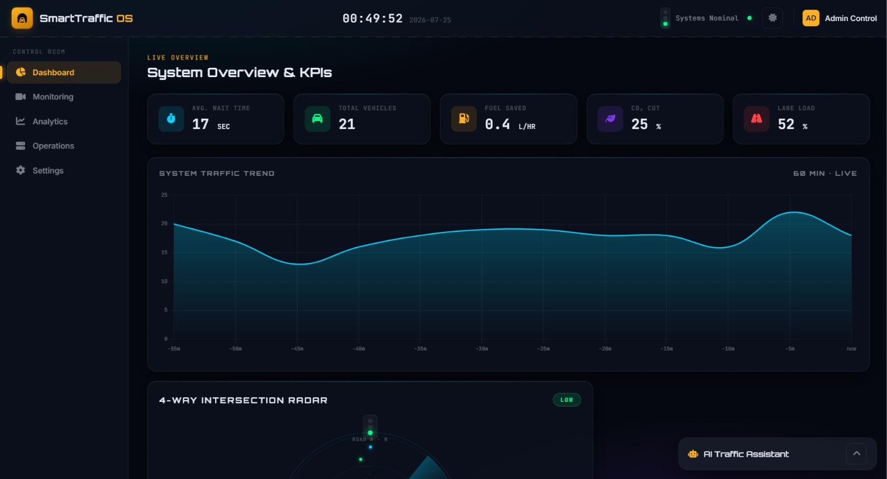
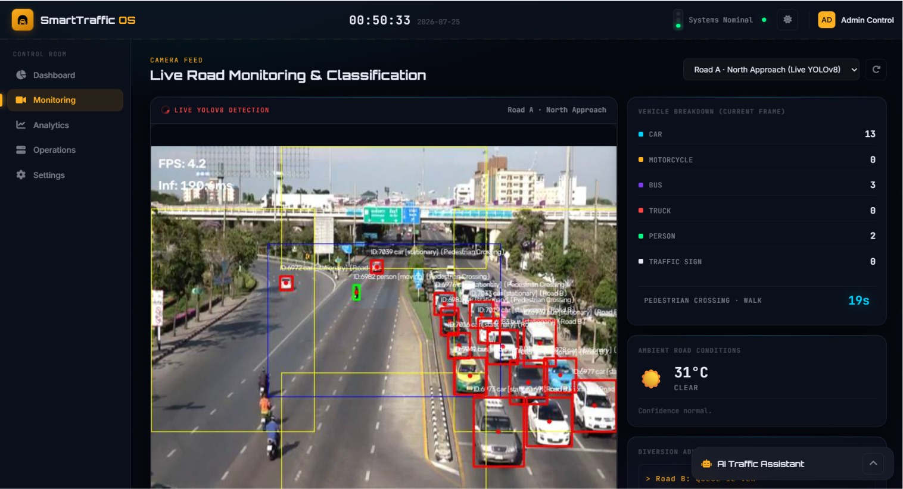
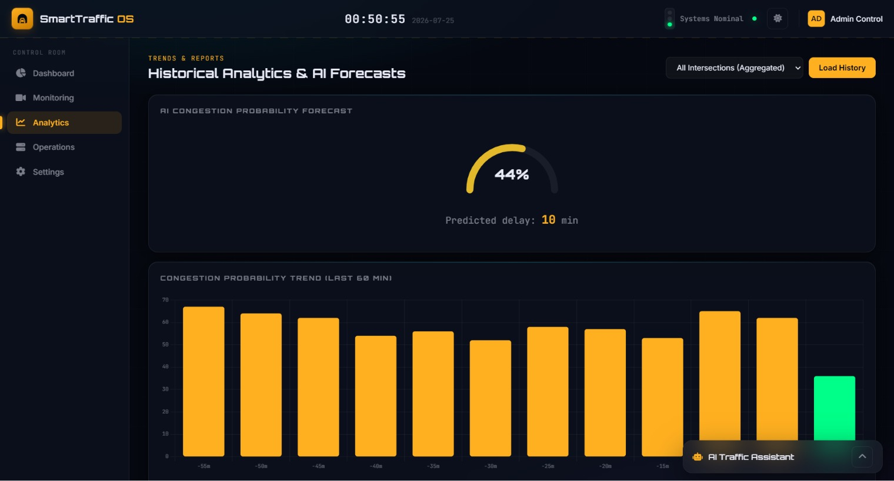
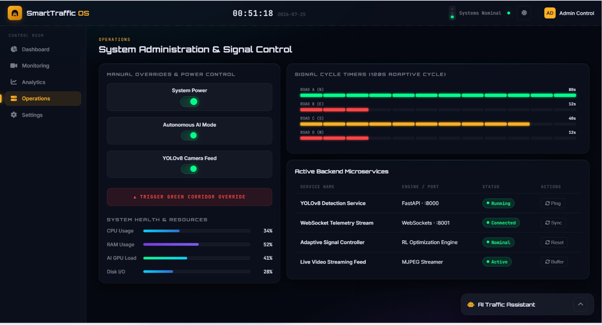
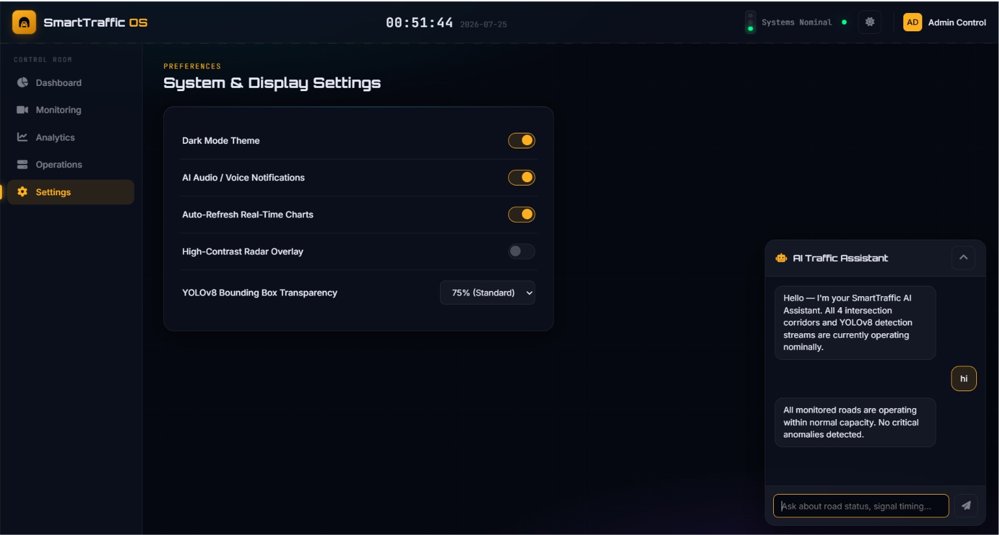
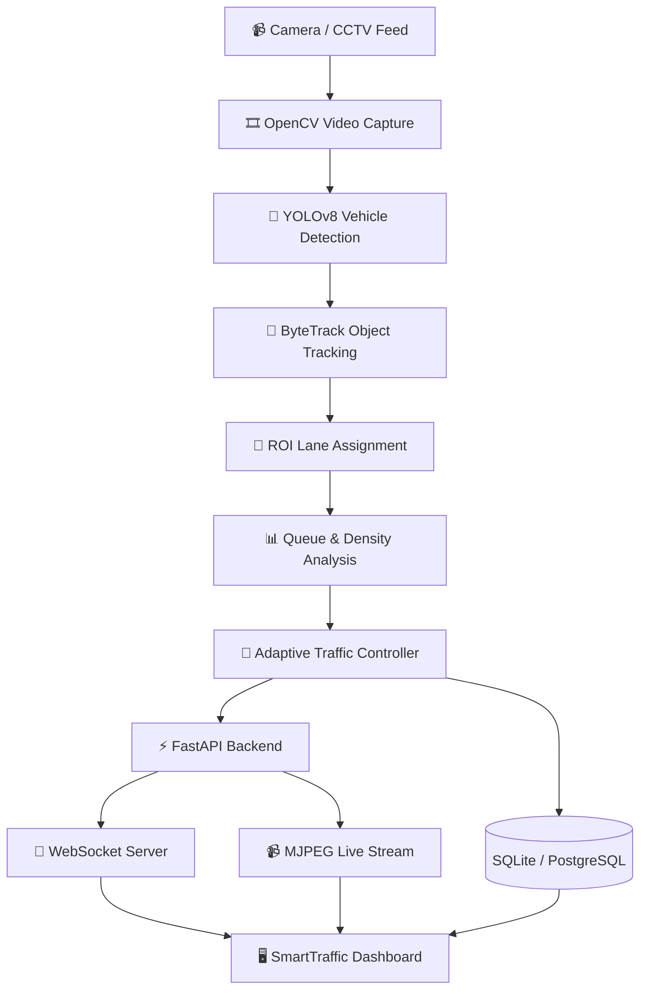

<div align="center">

# 🚦 SmartTraffic AI
### *AI-Powered Adaptive Traffic Management & Emission Reduction System*

### 🏆 Developed for the **Maverick AI Challenge 2026**

<p align="center">


</p>

### 🚗 Intelligent Traffic Monitoring • 🚦 Adaptive Signal Control • 🌱 Emission Reduction • 📊 Smart Analytics

---

### *Transforming traditional traffic intersections into intelligent AI-powered systems capable of reducing congestion, minimizing emissions, and improving urban mobility through real-time computer vision.*

</div>

---

# 📑 Table of Contents

- 📖 Overview
- 🚀 Problem Statement
- 💡 Our Solution
- ✨ Key Features
- 📸 Project Showcase
- 🧠 AI Processing Pipeline
- 🏗️ System Architecture
- ⚙️ Technology Stack
- 📂 Project Structure
- 🚀 Installation
- ▶️ Running the Project
- 📡 API Reference
- 📊 Dashboard Overview
- ⚡ Performance
- 🌱 Environmental Impact
- 🛣️ Future Enhancements
- 👨‍💻 Contributors
- 📄 License

---

# 📖 Overview

**SmartTraffic AI** is an intelligent traffic management platform designed to optimize urban intersections using Artificial Intelligence and Computer Vision.

Built for the **Maverick AI Challenge**, the system analyzes live traffic footage, detects and tracks vehicles, estimates congestion, predicts waiting times, and dynamically recommends traffic signal durations to improve traffic flow while reducing fuel consumption and carbon emissions.

Unlike conventional traffic systems that rely on fixed timers, SmartTraffic AI continuously adapts to real-world traffic conditions, enabling faster vehicle movement, reduced idle time, and smarter intersection management.

The platform combines **YOLOv8**, **ByteTrack**, **OpenCV**, **FastAPI**, **WebSockets**, and **SQLAlchemy** to provide a modern real-time traffic intelligence solution with a premium monitoring dashboard.

---

# 🚀 Maverick AI Challenge Problem Statement

### Smart Traffic & Emission Reduction

Urban intersections continue to rely on static traffic light schedules that fail to adapt to fluctuating traffic conditions.

This leads to:

- 🚗 Long vehicle queues
- ⏳ Increased waiting time
- ⛽ Excess fuel consumption
- 🌍 Higher CO₂ emissions
- 🚦 Traffic congestion
- 🚑 Delays for emergency vehicles

The challenge is to design an AI-powered traffic management system capable of monitoring intersections in real time and intelligently optimizing traffic flow while minimizing environmental impact.

---

# 💡 Our Solution

SmartTraffic AI leverages modern Computer Vision and Artificial Intelligence to transform ordinary CCTV cameras into intelligent traffic sensors.

Instead of using fixed signal timings, the system continuously analyzes vehicle movement, estimates lane congestion, detects queues, prioritizes emergency vehicles, and recommends adaptive traffic signal durations.

The complete system operates in real time through a FastAPI backend connected to a modern SmartTraffic OS dashboard via WebSockets.

### Core Workflow

```
Camera Feed
      │
      ▼
OpenCV Video Processing
      │
      ▼
YOLOv8 Vehicle Detection
      │
      ▼
ByteTrack Object Tracking
      │
      ▼
ROI Lane Assignment
      │
      ▼
Traffic Analysis
      │
      ▼
Adaptive Signal Controller
      │
      ▼
Database + Analytics
      │
      ▼
FastAPI WebSocket Server
      │
      ▼
SmartTraffic Dashboard
```

---

# ✨ Key Features

## 🤖 AI & Computer Vision

- Real-time vehicle detection using YOLOv8
- Multi-object tracking with ByteTrack
- ROI-based lane assignment using Shapely
- Lane-wise traffic density estimation
- Queue detection
- Vehicle counting
- Live confidence scoring
- Motion tracking
- FPS-independent processing
- Intelligent congestion estimation

---

## 🚦 Traffic Intelligence

- Adaptive traffic signal timing
- Dynamic green-light allocation
- Smart lane prioritization
- Queue-based optimization
- Emergency vehicle priority
- Pedestrian crossing management
- Live signal countdown
- Traffic prediction
- Intelligent congestion alerts

---

## 📊 Analytics

- Live vehicle statistics
- Vehicle type classification
- Historical traffic history
- Wait-time estimation
- Congestion prediction
- Fuel saving estimation
- Carbon emission reduction analysis
- Traffic trend visualization
- System performance monitoring

---

## 🌐 Backend

- FastAPI REST APIs
- Native WebSocket communication
- MJPEG live video streaming
- SQLAlchemy ORM
- Alembic migrations
- SQLite support
- PostgreSQL support
- Environment-based configuration
- Modular architecture

---

## 💻 Dashboard

- Premium SmartTraffic OS Interface
- Real-time AI camera feed
- Traffic signal visualization
- Live radar animation
- Analytics dashboard
- Dark / Light mode
- Event logs
- Manual signal override
- Responsive design
- Real-time charts

---

# 📸 Project Showcase

SmartTraffic OS provides an AI-powered command center for intelligent traffic monitoring, adaptive signal control, congestion prediction, and system administration. Below is a walkthrough of each module in the platform.

---

## 🏠 Dashboard

<p align="center">
  
</p>

The Dashboard provides a real-time overview of the traffic management system, displaying key performance indicators such as average waiting time, total detected vehicles, fuel savings, CO₂ emission reduction, lane utilization, and live traffic trends. It serves as the primary monitoring screen for traffic operators.

---

## 🎥 Live Road Monitoring

<p align="center">
  
</p>

The Monitoring module streams the live YOLOv8 detection feed with real-time object detection and tracking. It classifies vehicles, monitors pedestrian movement, displays environmental conditions, and provides AI-generated traffic insights to assist operators in managing road activity.

---

## 📊 Historical Analytics & AI Forecasts

<p align="center">
  
</p>

The Analytics module visualizes historical traffic patterns, congestion probability, predicted delays, and AI-generated forecasts. These insights enable authorities to analyze traffic behavior and make informed decisions for optimizing road infrastructure.

---

## ⚙️ Operations & Signal Control

<p align="center">
  
</p>

The Operations panel allows administrators to monitor backend microservices, system resources, adaptive traffic signal timing, and AI processing status. It also provides manual control features for managing signal operations whenever necessary.

---

## 🔧 System Settings

<p align="center">
  
</p>

The Settings module provides interface customization and system configuration options, including Dark Mode, AI voice notifications, real-time chart refresh, radar visualization, and YOLOv8 detection display preferences.

---

## 🌟 SmartTraffic OS Modules

| Module | Description |
|---------|-------------|
| 🏠 Dashboard | Live traffic KPIs and overall system overview |
| 🎥 Monitoring | Real-time AI-powered vehicle detection and tracking |
| 📊 Analytics | Historical reports, congestion prediction, and forecasting |
| ⚙️ Operations | Backend monitoring, signal management, and system controls |
| 🔧 Settings | User preferences and dashboard customization |

Together, these modules create a comprehensive Smart Traffic Management System that leverages Artificial Intelligence, Computer Vision, and real-time analytics to improve traffic flow, reduce congestion, minimize emissions, and support smart city infrastructure.

# 🧠 AI Processing Pipeline

Every video frame passes through a carefully designed AI pipeline that transforms raw camera footage into actionable traffic intelligence.

```
📹 Camera Input
        │
        ▼
🎞 OpenCV Frame Capture
        │
        ▼
🧠 YOLOv8 Object Detection
        │
        ▼
🚗 ByteTrack Vehicle Tracking
        │
        ▼
📍 ROI Lane Assignment
        │
        ▼
📊 Queue & Density Analysis
        │
        ▼
🚦 Adaptive Signal Optimization
        │
        ▼
💾 Database Logging
        │
        ▼
📡 FastAPI + WebSocket
        │
        ▼
🖥️ SmartTraffic Dashboard
```

---

# 🏗️ System Architecture

SmartTraffic AI follows a modular architecture where each component is responsible for a specific stage of the traffic analysis pipeline. This design improves maintainability, scalability, and real-time performance while allowing each module to operate independently.



---

# 🧠 Intelligent Traffic Analysis

Rather than simply detecting vehicles, SmartTraffic AI continuously interprets traffic behavior to make intelligent traffic management decisions.

## 🚗 Vehicle Detection

The system uses **YOLOv8** to detect multiple classes of road users with high speed and accuracy.

Supported classes include:

- 🚗 Car
- 🚌 Bus
- 🚚 Truck
- 🏍 Motorcycle
- 🚶 Person
- 🚦 Traffic Signs

---

## 🎯 Multi-Object Tracking

Using **ByteTrack**, every detected vehicle receives a persistent tracking ID.

This allows the system to:

- Track vehicle movement
- Avoid duplicate counting
- Estimate waiting time
- Monitor queue formation
- Calculate traffic density
- Analyze traffic flow

---

## 📍 ROI-Based Lane Assignment

Instead of relying only on image coordinates, SmartTraffic AI divides the road into predefined Regions of Interest (ROIs) using **Shapely polygons**.

This enables:

- Accurate lane detection
- Lane-wise vehicle counting
- Queue estimation
- Congestion analysis
- Adaptive signal allocation

---

## 🚦 Adaptive Signal Optimization

Traditional traffic lights use fixed signal durations.

SmartTraffic AI dynamically adjusts signal timing based on:

- Current lane congestion
- Queue length
- Waiting time
- Vehicle density
- Emergency vehicle detection

The lane with the highest traffic demand is automatically prioritized, resulting in smoother traffic flow and shorter waiting times.

---

## 🚑 Emergency Vehicle Priority

Emergency response vehicles require uninterrupted movement.

Whenever an emergency vehicle is detected, the system can:

- Prioritize the affected lane
- Allocate immediate green signals
- Reduce response time
- Resume normal traffic flow after clearance

---

## 📊 Traffic Analytics

The system continuously generates meaningful traffic insights including:

- Total vehicle count
- Vehicle classification
- Lane occupancy
- Queue length
- Average waiting time
- Congestion probability
- Fuel savings
- CO₂ emission reduction
- System performance statistics

These analytics assist authorities in making data-driven traffic management decisions.

---

# ⚙️ Technology Stack

## Backend

| Component | Technology |
|------------|------------|
| Framework | FastAPI |
| Language | Python 3.10+ |
| Server | Uvicorn |
| Real-Time Communication | Native WebSockets |
| Video Streaming | MJPEG StreamingResponse |
| Configuration | Pydantic |

---

## Artificial Intelligence

| Component | Technology |
|------------|------------|
| Object Detection | YOLOv8 (Ultralytics) |
| Object Tracking | ByteTrack |
| Image Processing | OpenCV |
| Lane Geometry | Shapely |

---

## Database

| Component | Technology |
|------------|------------|
| ORM | SQLAlchemy |
| Development Database | SQLite |
| Production Database | PostgreSQL |
| Migration Tool | Alembic |

---

## Frontend

| Component | Technology |
|------------|------------|
| Structure | HTML5 |
| Styling | CSS3 |
| Logic | Vanilla JavaScript |
| Charts | Chart.js |
| Communication | Native WebSockets |

---

## Additional Libraries

| Library | Purpose |
|-----------|---------|
| Pydantic | Data Validation |
| SQLAlchemy | Database ORM |
| Alembic | Database Migration |
| OpenCV | Video Processing |
| Ultralytics | YOLOv8 Framework |
| Shapely | ROI Geometry |
| LAPX | ByteTrack Assignment |
| python-dotenv | Environment Variables |

---

# 📂 Project Structure

```text
SmartTraffic-AI/
│
├── backend/
│   ├── ai_engine.py
│   ├── traffic_logic.py
│   ├── websocket_manager.py
│   ├── database.py
│   ├── db_models.py
│   ├── models.py
│   ├── config.py
│   ├── main.py
│   ├── requirements.txt
│   └── alembic/
│
├── frontend/
│   ├── index.html
│   ├── style.css
│   ├── app.js
│   └── assets/
│
├── docs/
├── dashboard.jpeg
├── monitoring.jpeg
├── analytics.jpeg
├── operations.jpeg
└── settings.jpeg
|
│
├── run_backend.bat
├── run_frontend.bat
├── setup.bat
├── start_project.bat
│
└── README.md
```

---

# 🚀 Getting Started

## Prerequisites

Before running the project, ensure the following are installed:

- Python 3.10 or later
- pip
- Git
- Modern web browser

---

## Installation

Clone the repository

```bash
git clone https://github.com/ghadiyadisha748/Traffic-Manegement-Systems.git
```

Navigate to the project directory

```bash
cd Traffic-Manegement-Systems
```

Create a virtual environment

```bash
python -m venv venv
```

Activate the virtual environment

### Windows

```bash
venv\Scripts\activate
```

### Linux / macOS

```bash
source venv/bin/activate
```

Install project dependencies

```bash
pip install -r backend/requirements.txt
```

---

# ▶️ Running the Project

### Start Backend

```bash
run_backend.bat
```

or

```bash
uvicorn backend.main:app --reload
```

---

### Start Frontend

```bash
run_frontend.bat
```

or simply open

```text
frontend/index.html
```

---

### Start Complete System

```bash
start_project.bat
```

Once the backend starts successfully, open your browser and access the SmartTraffic Dashboard.

---

# 📡 API Reference

| Method | Endpoint | Description |
|----------|-----------|-------------|
| GET | `/` | Home Route |
| GET | `/video_feed` | Live AI Video Stream |
| GET | `/api/dashboard` | Dashboard Information |
| GET | `/api/history` | Historical Traffic Data |
| GET | `/api/system` | System Health |
| GET | `/api/intersections` | Intersection Details |
| GET | `/api/signals` | Signal Information |
| WebSocket | `/ws` | Live Dashboard Updates |

---

# 📖 API Documentation

Interactive API documentation is automatically generated by FastAPI.

### Swagger UI

```
http://localhost:8000/docs
```

### ReDoc

```
http://localhost:8000/redoc
```

---

# 🖥️ Dashboard Overview

The SmartTraffic dashboard acts as a centralized command center for monitoring and managing traffic operations in real time.

### Live Monitoring

- AI Camera Feed
- Bounding Box Visualization
- Vehicle Tracking
- FPS Monitoring

### Traffic Control

- Signal Status
- Lane Prioritization
- Countdown Timer
- Manual Override

### Analytics

- Traffic Density
- Congestion Trends
- Vehicle Distribution
- Historical Insights

### Environmental Metrics

- Estimated Fuel Savings
- CO₂ Reduction
- Average Waiting Time
- Traffic Efficiency

### System Health

- Backend Status
- AI Engine Status
- WebSocket Connectivity
- Processing Latency

---
---

# ⚡ Performance Summary

The current implementation is designed to process recorded or live video streams efficiently while providing real-time traffic insights.

| Feature | Implementation |
|---------|----------------|
| Object Detection | YOLOv8 |
| Object Tracking | ByteTrack |
| Backend Framework | FastAPI |
| Video Processing | OpenCV |
| Database | SQLite / PostgreSQL |
| Live Updates | WebSockets |
| Video Streaming | MJPEG |
| Dashboard | HTML, CSS & JavaScript |

The modular architecture allows individual components to be improved or replaced without affecting the overall system.

---

# 🌱 Environmental Impact

SmartTraffic AI focuses on improving traffic flow by adapting signal timings according to current traffic conditions.

Potential benefits include:

- 🚦 Reduced traffic congestion
- ⏳ Lower vehicle waiting time
- ⛽ Reduced fuel consumption due to less idling
- 🌍 Lower carbon emissions
- 🚑 Improved traffic movement during peak hours

While the current system demonstrates these concepts using AI-based traffic analysis, future deployment with real-world traffic infrastructure could further enhance these benefits.

---

# 🔮 Future Scope

This project establishes the foundation for an intelligent traffic management system. Future improvements may include:

- Multi-intersection traffic coordination
- Emergency vehicle detection and automatic signal priority
- Number plate recognition (ANPR)
- Weather-aware traffic optimization
- Reinforcement Learning based signal control
- Historical traffic prediction using AI
- Cloud deployment for remote monitoring
- Docker-based deployment
- Mobile dashboard for traffic monitoring
- Integration with Smart City infrastructure
- Enhanced analytics and reporting

---

# 🤝 Contributing

Contributions are welcome.

If you would like to improve this project:

1. Fork the repository.
2. Create a feature branch.

```bash
git checkout -b feature/new-feature
```

3. Commit your changes.

```bash
git commit -m "Add new feature"
```

4. Push the branch.

```bash
git push origin feature/new-feature
```

5. Open a Pull Request.

---

# 👨‍💻 Authors

<div align="center">

**Anvi Shah**  
**Heshvi Shah**  
**Disha Ghadiya**  
**Anshika Badala**  
**Liza Soni**

</div>

---

# 🙏 Acknowledgements

This project was developed as part of the **Maverick AI Challenge 2026**.

We sincerely thank the developers and communities behind the open-source technologies that made this project possible.

- Ultralytics (YOLOv8)
- FastAPI
- OpenCV
- SQLAlchemy
- ByteTrack
- Shapely
- Chart.js

---

# 📄 License

This project is intended for **educational, research, and hackathon purposes**.

Feel free to use and build upon this project with appropriate attribution to the authors.

---

<div align="center">

## ⭐ If you found this project interesting, consider giving it a star!

### 🚦 SmartTraffic AI
#### *AI-Powered Adaptive Traffic Management & Emission Reduction System*

**Built with Python • FastAPI • YOLOv8 • OpenCV • ByteTrack**

**Developed for the Maverick AI Challenge 2026**

</div>
